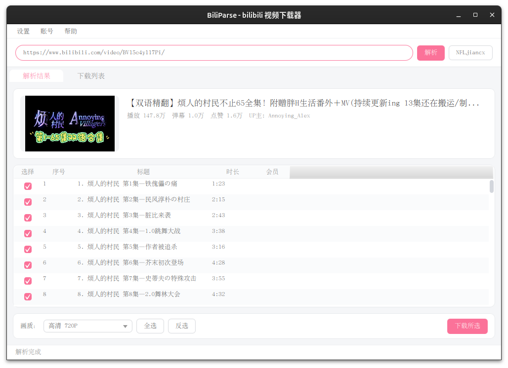
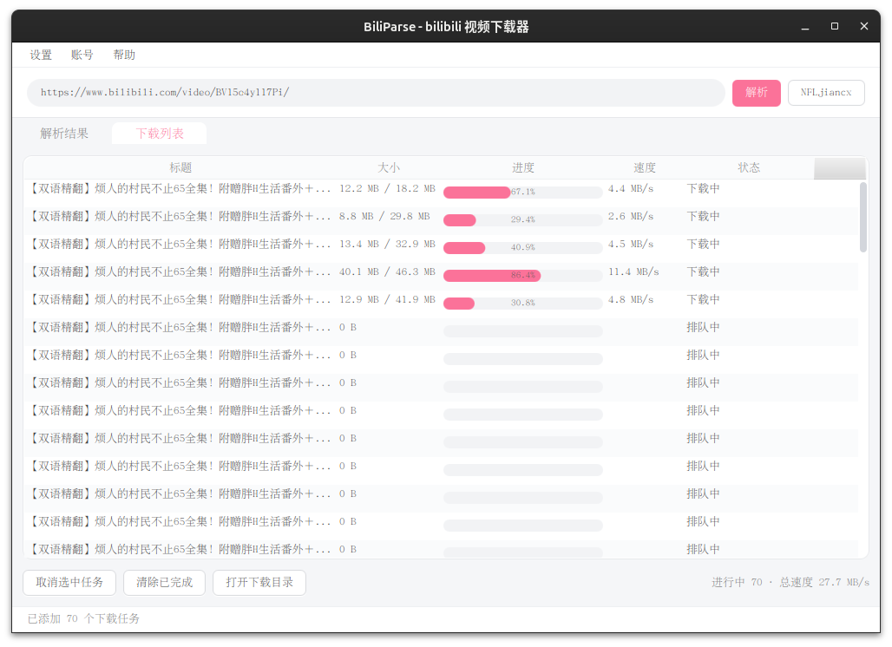

# BiliParse

一个基于 **JavaFX** 的 Bilibili 视频下载桌面工具：粘贴链接即可解析，支持扫码登录、多集批量下载、DASH 音视频自动混流，界面采用 bilibili 粉主题，简洁轻量。





## 功能特性

- **多类型链接解析**：支持 BV 号 / av 号 / 视频页 URL / `b23.tv` 短链 / 番剧（ss/ep/md），自动识别并展开剧集列表
- **扫码登录**：内置二维码扫码登录（Cookie 本地持久化），登录后可获取更高画质
- **画质选择**：10 档画质可选（360P ~ 8K，视账号权益与视频支持情况）
- **批量下载**：多 P / 番剧剧集勾选批量下载，自动按剧集建子目录，文件名带序号（如 `1-视频标题.mp4`）
- **DASH 混流**：自动下载音视频分离的 DASH 流，调用 FFmpeg 合并为标准 mp4
- **高速下载**：单文件分段多线程下载 + HTTP Range 断点续传，任务级并发控制
- **下载管理**：实时进度（平滑过渡动画）、速度统计、取消任务、清除已完成、打开下载目录

## 技术栈

| 组件 | 说明 |
| --- | --- |
| Java 21 | 语言与运行时 |
| JavaFX 21.0.12 | 图形界面（javafx-controls + javafx-swing） |
| Maven | 构建打包（shade 插件生成可执行 JAR） |
| Gson | JSON 解析 |
| ZXing | 登录二维码生成 |
| FFmpeg | DASH 音视频混流（外部程序，需系统安装） |

## 环境要求

- JDK 21+
- Maven 3.8+
- FFmpeg（位于 `PATH` 中，或在设置里指定路径）

Linux 下直接运行即可；开发环境为 Ubuntu 24.04 + Wayland 验证通过。

## 构建与运行

```bash
# 打包生成可执行 JAR
mvn package
java -jar target/biliparse.jar

# 或以开发模式运行
mvn javafx:run
```

## 使用方法

1. 启动后在顶部输入框粘贴 B 站视频 / 番剧链接（或 BV 号、b23.tv 短链），点击「解析」
2. 在「解析结果」页查看封面与剧集列表，勾选要下载的分集（默认全选）
3. 选择画质，点击「下载所选」，任务进入「下载列表」页
4. 在下载列表页可查看进度与速度、取消任务、清除已完成
5. 需要高画质时点击右上角账号按钮扫码登录；下载目录与并发参数可在「设置」中调整

## 项目结构

```
src/main/java/com/biliparse/
├── api/          # B 站 API 封装：BiliApi、WebClient、WbiSign 签名、CookieManager
├── model/        # 数据模型：Episode、ParseResult、PlayUrlData、Quality
├── service/      # ParseService 解析服务（URL 识别 → 剧集列表 → 播放地址）
├── download/     # 下载引擎：StreamDownloader 分段下载、DownloadManager 调度、DownloadJob
├── ui/           # JavaFX 界面：MainApp 主窗口、DownloadView、LoginDialog、SettingsDialog、app.css
└── util/         # Config 配置、InputParser 输入解析、QrUtil 二维码、StringUtils
```

## 配置文件

配置持久化在用户目录下：

- `~/.biliparse/config.properties` — 下载目录、FFmpeg 路径、并发任务数（默认 2）、单文件线程数（默认 4）
- `~/.biliparse/cookies.txt` — 登录 Cookie

## 免责声明

本项目仅供个人学习与研究使用，请勿用于任何商业用途或批量抓取。下载内容版权归原作者及 Bilibili 所有，请遵守 B 站用户协议与相关法律法规。
